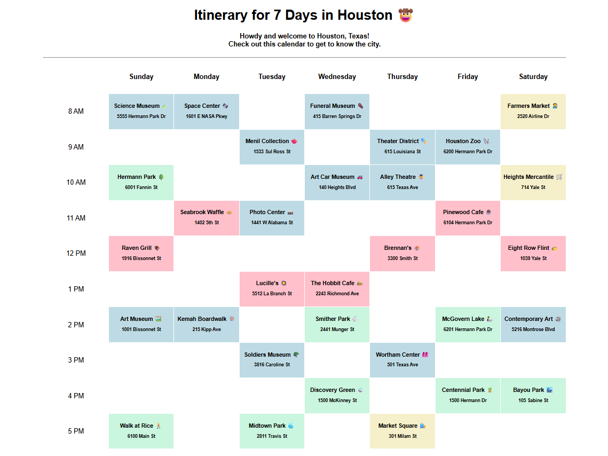

# 🌆 Houston Week Itinerary (Timetabled) – CodePath WEB102 Lab 1

This project is a grid-style weekly calendar web app built as part of **CodePath's WEB102 Lab 1**. It showcases a single week's itinerary of one-hour events, featuring attractions and activities based in **Houston, Texas**.

## 🧪 Lab Objective

The primary focus of this lab was to:
- Build UI using **React components**
- Pass and use **props** to render dynamic data
- Practice using **JavaScript ES6** features within a React-based project
- Organize a user-friendly layout using **component-driven design**

## 🛠️ Tech Stack

- ⚛️ **React** – Component-based UI development
- ⚡ **Vite** – Fast development and build tool
- 🟨 **JavaScript (ES6)** – Modern syntax and structure
- 💅 **CSS Modules**

## 📅 App Overview

The application renders a **7-day weekly calendar** (Sunday–Saturday), where each day features a full itinerary from 8:00 AM to 5:00 PM. Each hourly block includes:
- Event name
- Location (Houston-based attractions)
- Event color coding
  - 🔴 Red for restaurants
  - 🔵 Blue for general attractions
  - 🟡 Yellow for shopping centers
  - 🟢 Green for parks

### Features:
- Events rendered dynamically using data passed via props
- Reusable `Event` and `Calendar` components
- Clean, grid-style layout



## 📂 Project Structure
```
src/
├── components/
│   ├── Calendar.jsx
│   └── Event.jsx
├── App.jsx
└── main.jsx
index.html
```

## 🚀 Getting Started
### 1. Clone the repo:
```
git clone https://github.com/your-username/houston-itinerary-lab.git
cd houston-itinerary-lab
```

### 2. Install dependencies:
```
npm install
```

### 3. Run the app:
```
npm run dev
```

### 4. View it locally:
Open http://localhost:5173 in your browser.

## ✏️ Author
Created by **Khanh Nguyen** as part of CodePath's WEB102 curriculum.

## 📄 License
This project is for educational purposes under CodePath's Web Development 102 curriculum. Open for personal and learning use.
